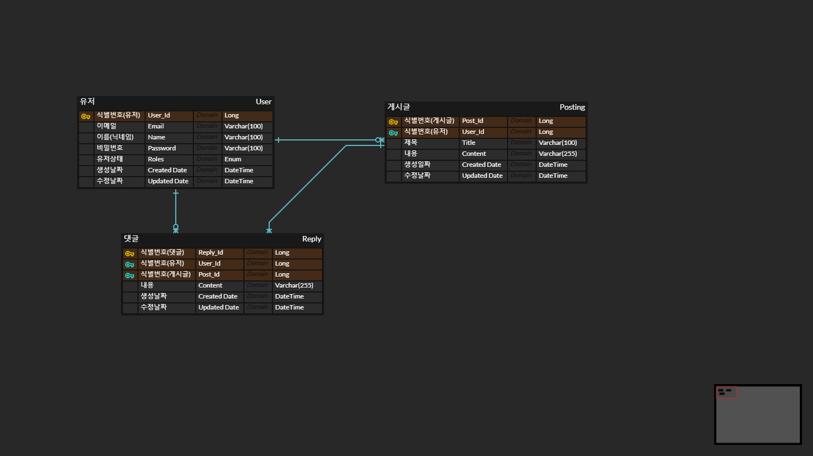

# 프로그램 정의서

<aside>
💡 주제별 구현 기능

- **주제 3. 커뮤니티 과제**
    - [ ]  게시물 검색 기능
    - [ ]  게시글 관리 기능(게시글 작성/게시글 목록 조회/작성된 게시글 편집/ 게시글 삭제)
    - [ ]  게시판 글 이력조회(기간별)
    - [ ]  로그인 / 로그아웃에 따른 편집 허가 기능 구현
        
        → 일반 회원은 로그인시 자신의 게시글만 편집 및 삭제 가능
        
        → 관리자는 모든 게시글 삭제 가능
        
</aside>

📌 주제 : 커뮤니티 구현

블라인드와 다른 타 커뮤니티 처럼 구현을 해보면서 이때까지 사용했던 기술들을 다시 리마인드를 가지는 시간을 가지고 싶습니다.

특히 시큐리티 버전이 바뀌고 제로베이스 강의가 구버전 강의였어서 스스로 공부를 했어야 했는데 이번 기회에 다시 깊게 살펴보면서 활용하는 방법을 익혀보도록 하겠습니다.

또한 배포의 경험이 없기 때문에 배포도 이번 기회에 도전해보고 싶습니다.

---

## 프로젝트 기능

📌 회원가입 및 로그인

- 회원 가입
    - 회원가입시 이메일, 이름 전화번호, 비밀번호 개인 정보를 입력받게 받아서 회원가입을 하다록 요구
    - 만약 공통된 이메일 주소로 가입을 할시 에러를 발생시킴
- 로그인
    - 로그인시 이메일 입력을 받도록 한다 만약 잘못입력을 한 경우 에러를 발생시킨다
    - 로그인을 할시 Access 토큰과 Refresh 토큰을 발행시켜서 앞으로의 대부분의 모든 api에서 사용할시 jwt access 토큰을 필요하도록 한다
- 로그아웃
    - 로그아웃시 로그아웃을 사용했던 access 토큰을 redis에 저장해서 보관하도록 한다 이로 인해서 다시 로그인을 하지 않을시 사용할수 없도록 한다(BlackList 처리)

📌 게시판 글 및 댓글 작성

- 게시판 글은 누구나 볼수가 있도록 한다(로그인을 안해도 볼수 있음)
- 게시판 글은 로그인한 유저가 작성을 할수가 있다
- 게시판 글의 댓글은 로그인한 유저가 작성할수가 있다
- 게시판 글을 작성할수가 있다

📌 게시판 글 수정, 삭제

- 게시판 글을 작성 한 사람만 글이 수정이 가능하다
- 관리자는 글을 작성한 여부와 상관없이 글을 삭제 및 수정이 가능하다

📌 게시판 글 목록 조회

- 게시판 글을 기간별로 조회가 가능하다
- 카테고리 별로 조회가 가능하다
- 글 타이틀을 입력해서 조회할수가 있다(다 작성하지 않아도 조회가 가능)

📌 게시글 상세 조회

- 게시판 글을 생성일, 수정일, 본문의 내용, 작성자를 확인할수 있도록한다

기본적인 기능 개발 후 개발 기간이 남으면 기능 추가하는 형식으로 진행

---

# ERD

---

# 사용 기술 스택

- SpringBoot
- Java
- MySQL
- JPA
- Spring Security
- Redis
- Docker + EC2 배포